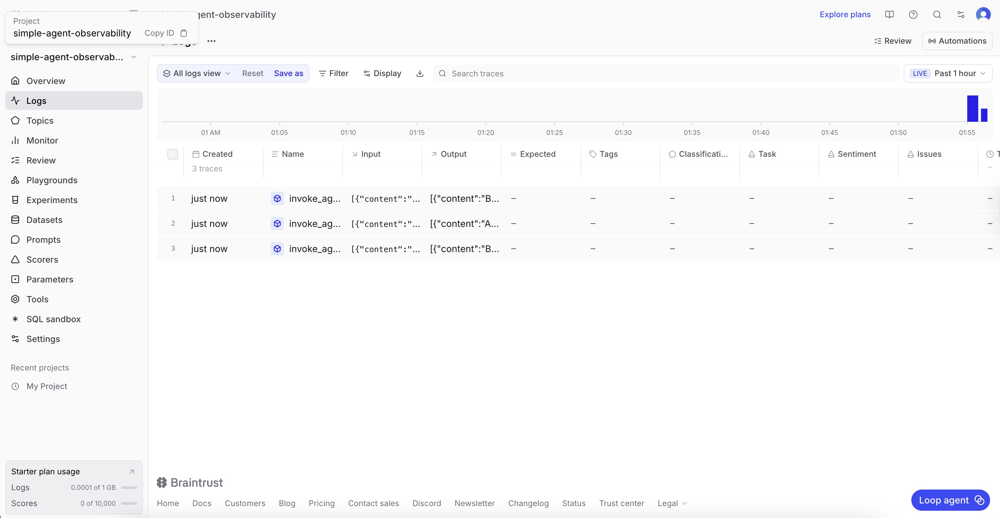
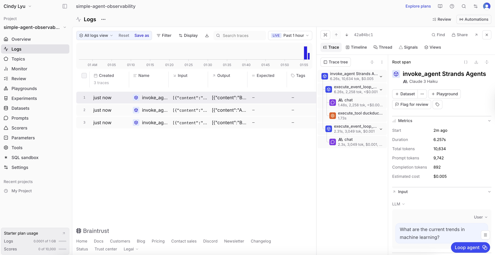
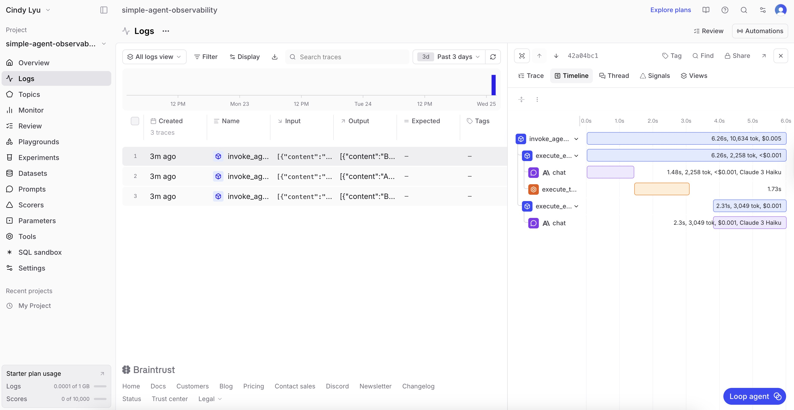

# Braintrust Observability Analysis

From the overview dashboard, I observe that multiple traces are recorded for different agent runs, each corresponding to a single query execution. The traces appear as separate entries with consistent structure, indicating that each interaction with the agent is logged independently.

From the trace details view, the hierarchy of operations is clearly visible. Each trace is structured as a tree of spans, starting from the root span (`invoke_agent`) and expanding into sub-operations such as event loops, LLM calls, and tool executions (e.g., DuckDuckGo search). This reveals the internal workflow of the agent, showing how it alternates between reasoning and tool usage. The separation of spans makes it easy to understand the sequence and dependencies of actions within a single query.

From the metrics view, I observe detailed performance and cost-related metrics. Each trace records latency (duration), token usage (prompt and completion tokens), and estimated cost. A noticeable pattern is that prompt tokens dominate total token usage, suggesting that the context or system prompts are relatively large. The timeline also shows that tool calls introduce additional latency compared to pure LLM responses. These observations provide insight into both computational cost and performance characteristics, highlighting where optimization could be applied.

